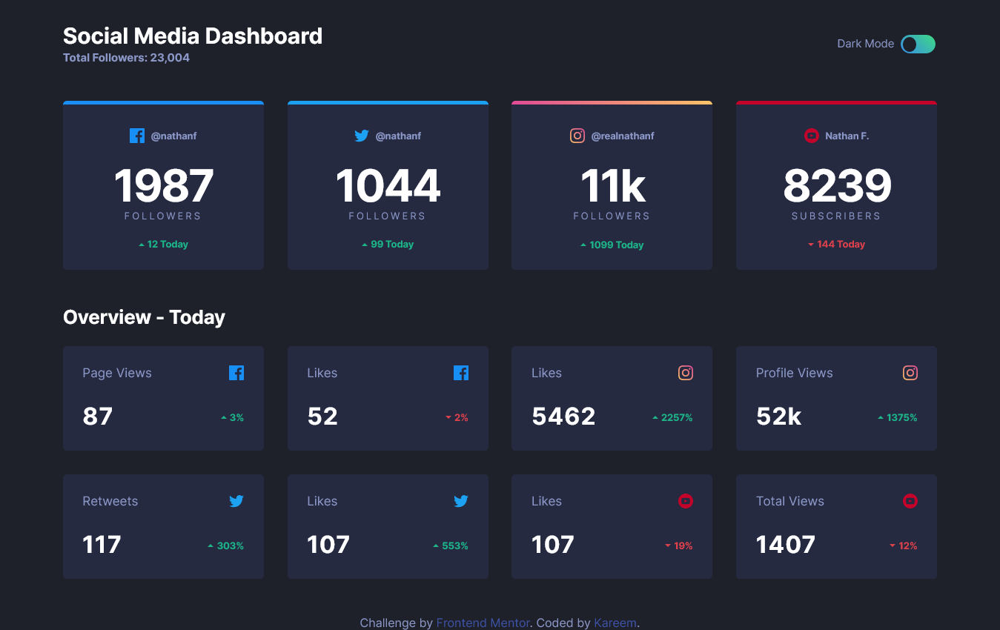

# Social-Media-Dashboard-With-Theme-Switcher

A frontend mentor challenge

# Frontend Mentor - Social media dashboard with theme switcher solution

This is a solution to the [Social media dashboard with theme switcher challenge on Frontend Mentor](https://www.frontendmentor.io/challenges/social-media-dashboard-with-theme-switcher-6oY8ozp_H). Frontend Mentor challenges help you improve your coding skills by building realistic projects.

## Table of contents

- [Overview](#overview)
  - [The challenge](#the-challenge)
  - [Screenshot](#screenshot)
  - [Links](#links)
- [My process](#my-process)
  - [Built with](#built-with)
  - [What I learned](#what-i-learned)
  - [Continued development](#continued-development)
  - [Useful resources](#useful-resources)
- [Author](#author)
- [Acknowledgments](#acknowledgments)

## Overview

### The challenge

Users should be able to:

- View the optimal layout for the site depending on their device's screen size
- See hover states for all interactive elements on the page
- Toggle color theme to their preference

### Screenshot

### Links

- Solution URL: [Solution url](https://github.com/talentlessDeveloper/Social-Media-Dashboard-With-Theme-Switcher/)
- Live Site URL: [Live Site](https://talentlessdeveloper.github.io/Social-Media-Dashboard-With-Theme-Switcher/)

## My process

### Built with

- Semantic HTML5 markup
- CSS custom properties
- Flexbox
- CSS Grid
- Mobile-first workflow
- Scss
- gulp

### What I learned

Learned about the media query \*\*prefers-color-scheme and learnt how to access root using javascript. Also learned a bit about importance of accessibility in website

### Continued development

Would love to work more on theme switchers , using toggle to alternate between light and dark mode.

### Useful resources

Mostly from Jessica Chans (Coder Coder) Platform on youtube. She is an amazing developer.

## Author

- Frontend Mentor - [@yourusername](https://www.frontendmentor.io/profile/talentlessDeveloper)
- Twitter - [@yourusername](https://www.twitter.com/kcreeem)

## Acknowledgments

Again a big shout out to Jessica Chan @coder coder on youtube.

-
